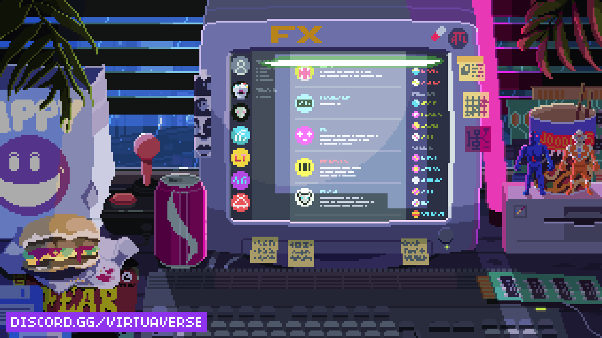

### 🖤 inspo / moodboard

<h1 align="center">👾 Hello!! I'm Asna Mirza </h1>
<h3 align="center">Game Dev in the making • CS Undergrad • Author</h3>

  

---

## 🧠 about_me.exe

🎓 **Undergraduate Computer Science Student**  
💻 I like solving problems, breaking code, fixing it, and pretending it was intentional  
🌱 Currently learning **DSA, Java, Python & Web Development**  
🎮 Deeply into **Game Development** (interactive > static, always)  
🤖 Exploring **AI / ML** because the future is already here  
🛡️ Curious about **Cyber Security** (learning how systems break before securing them)  
🏢 Long-term goal: work with big tech like **Samsung**  
🚀 Currently building strong fundamentals, meaningful projects & open-source confidence  

## 🏆 My Holopin Rack 😎

⚡ **Fun Fact:** I genuinely think I have a good eye for fashion 👀🖤  

---

## 🔭 current grind (no breaks, only commits)

📌 **DBMS**  
- SQL queries, schemas & relationships  
- Normalization, keys, transactions  
- Slowly accepting that DBMS has feelings  

🛡️ **Cyber Security**  
- Core security principles  
- Common vulnerabilities & attack surfaces  
- Learning how *not* to get hacked  

🧮 **Data Structures & Algorithms**  
- Arrays, stacks, queues, linked lists  
- Logic building & efficiency-focused thinking  
- Practicing problem-solving daily  

☕ **Java**  
- Object-Oriented Programming  
- Weekly assignments + practice problems  
- Writing cleaner, readable & structured code  

🐍 **Python**  
- Logic building & scripting  
- Small experiments & practice programs  

🌐 **Web Development**  
- HTML, CSS, JavaScript  
- Building interfaces that work *and* look aesthetic  

---

## 👨‍💻 projects & repositories (WIP but valid 🔥)

🔗 **All my projects live here:**  [Github-pageasna](https://github.com/pageasna)  

### 📘 C Programs
- Core **Data Structures** implementations  
- Arrays, stacks, queues, linked lists  
- Focused on fundamentals, clarity & logic  

### ☕ Java Programs
- Weekly academic assignments  
- OOP-focused programs  
- Problem-solving & structured solutions  

### 👀 Upcoming
- DBMS mini-projects  
- Cyber Security labs  
- Game dev experiments 🎮  

📄 **Experience**  
- **Team Engage @ IEEE CS**

---

## 🛠️ tech stack (tools I survive on)

  
  
  
  
  
  
  
  
  
  
  

---

## 🔧 skills & strengths

- **Languages:** C, C++, Java, Python, HTML, CSS, JavaScript  
- **Concepts:** DSA, OOP, DBMS  
- **Tools:** Git, GitHub, VS Code, IntelliJ IDEA  
- **Soft Skills:** Logical thinking, problem-solving, teamwork  

---

## 🎧 currently playing (on repeat / coding fuel)

  👉 <a href="https://open.spotify.com/user/315kywbcgumr3j4c4bwdb7ykxigy?si=4XKz39gpTo2wKNATMFMtbg">click me, enter the void</a>

🎶 Late nights, soft lights, code compiling, music flowing  
🖤 The playlist that fuels problem-solving & creative chaos  

---

## 🌐 connect_with_me();

  
  
  

📫 **Email:** asnamirza2020@gmail.com  

---

## 📊 github stats (numbers but aesthetic af)

  

  

## ✍️ Random Dev Quote

---

🌑 *Learning. Building. Leveling up.*  
🎮 *Main quest: cracked software dev arc.*  
🖤 *Moodboard, music, code – everything fueling the journey.*

<!--Snake Game Repo View -->

 

  

 
