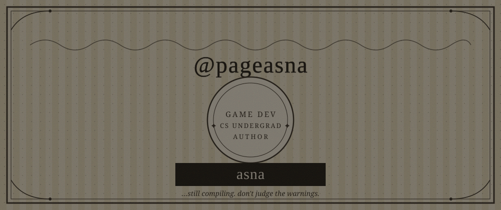

<p align="center">
  
</p>

<p align="center">
  ⋆｡°✩ ────────────────────────────────── ✩°｡⋆
</p>

<h1 align="center">
  <sub>⟢</sub> a s n a <sub>⟣</sub>
</h1>

<p align="center">
  
</p>

<p align="center">
  ❝ <em>still figuring it out . — loop .</em> ❞
</p>

<p align="center">
  game dev in the making · cs undergrad · author
</p>

<p align="center">
  she / they &nbsp;✦&nbsp; utc +5:30 &nbsp;✦&nbsp; breaking code, fixing it, pretending it was intentional
</p>

<p align="center">
  ⋆⋅☆⋅⋆
</p>

<br/>

<table align="center">
<tr>
<td width="50%" valign="top">

### ྀི &nbsp;currently

```yaml
learning:   [dsa, java, python, web dev]
exploring:  [ai/ml, cyber security]
building:   toward samsung, one commit at a time
```

</td>
<td width="50%" valign="top">

### ྀི &nbsp;main quest

```yaml
status:     🎮 game dev > everything else
engine:     Unity — prototyping little worlds
brain:      50% DSA, 50% "but what if this
             were a game"
```

</td>
</tr>
</table>

<p align="center">
  ────── ⋆⋅☆⋅⋆ ──────
</p>

<h3 align="center">঄ tech stack ঄</h3>

<p align="center">
  
</p>

<p align="center">
  
  
  
  
  
  
  
  
</p>

<p align="center">
  ────── ⋆⋅☆⋅⋆ ──────
</p>

<h3 align="center">঄ a l g o r i t h m ঄</h3>

<p align="center">
  
  
</p>

<p align="center">
  
</p>

<p align="center">
  
</p>

<p align="center">
  ────── ⋆⋅☆⋅⋆ ──────
</p>

<details>
<summary align="center"><b>঄ a few things about me ঄</b></summary>
<br/>

<p align="center">
  ⟡ half-built games live in my repos, waiting for "one more feature"<br/>
  ⟡ i debug out loud and blame the compiler first, myself second<br/>
  ⟡ i write on the side — stories before code, most days<br/>
  ⟡ dni if you're here to argue about tabs vs spaces
</p>

</details>

<p align="center">
  ────── ⋆⋅☆⋅⋆ ──────
</p>

<h3 align="center">঄ find me ঄</h3>

<p align="center">
  <a href="https://github.com/pageasna"></a>
  <a href="https://www.linkedin.com/in/asna-mirza"></a>
  <a href="https://instagram.com/pageasna"></a>
  <a href="https://discord.gg/anneverse13"></a>
  <a href="mailto:asnamirza2020@gmail.com"></a>
</p>

<p align="center">
  
</p>

<p align="center">
  ⋆｡°✩ ────────────────────────────────── ✩°｡⋆
</p>

<p align="center">
  <sub>asna &nbsp;·&nbsp; she/they &nbsp;·&nbsp; utc+5:30 &nbsp;·&nbsp; thank you for stopping by</sub>
</p>
